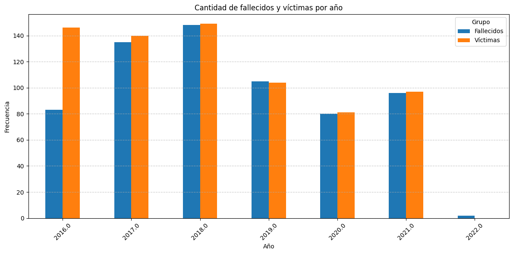
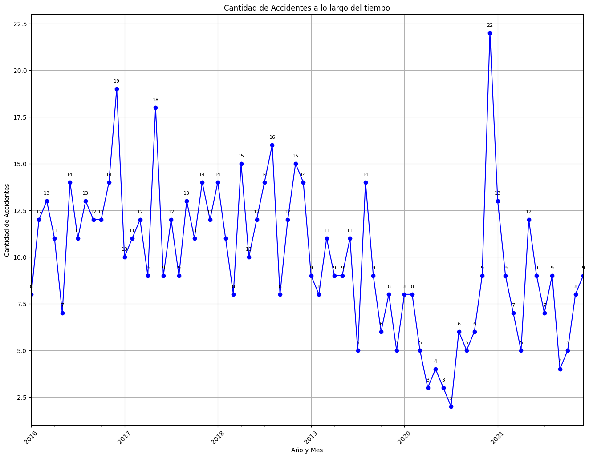
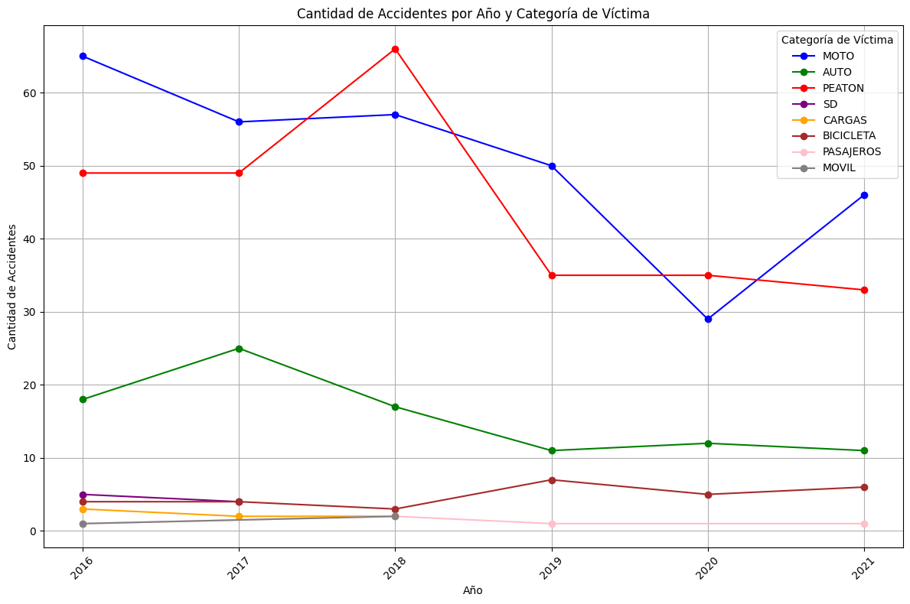
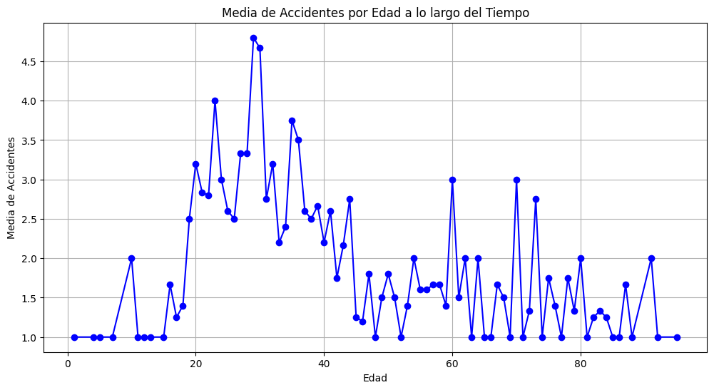
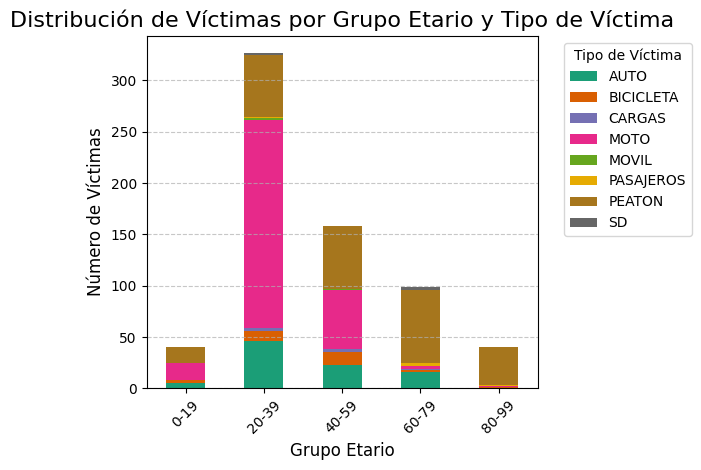
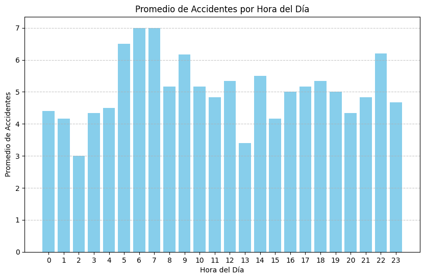

## Introducción
---

Los siniestros viales representan una preocupación significativa en entornos urbanos como
Buenos Aires, con consecuencias que van desde daños materiales hasta pérdidas humanas. En este
contexto, el Observatorio de Movilidad y Seguridad Vial (OMSV) solicita un análisis de datos sobre los
accidentes viales ocurridos en la ciudad entre 2016 y 2021. Este análisis tiene como objetivo identificar
patrones y factores de riesgo para informar la implementación de medidas que reduzcan la cantidad de
víctimas fatales.
En Argentina, los siniestros viales constituyen una de las principales causas de muerte violenta, con un
promedio de cerca de 4.000 víctimas fatales por año. El presente informe se enfoca en el análisis de
datos proporcionados por el OMSV, con la meta de generar recomendaciones basadas en evidencia que
contribuyan a mejorar la seguridad vial en Buenos Aires.

## Metodología de trabajo
---

Para llevar a cabo el análisis de los datos de siniestros viales en la Ciudad de Buenos Aires, se siguió
una metodología de trabajo estructurada en varias etapas, abarcando desde la extracción y
transformación de los datos hasta la identificación de posibles anomalías y la preparación del conjunto
de datos para su análisis.

### 1. Transformación de la Base de Datos a DataFrames:
- Se importaron las librerías necesarias, principalmente pandas, para manejar los datos en
Python.
- Los datos fueron cargados desde archivos Excel en dos DataFrames distintos: df_victimas y
df_hechos .
- Se realizó una fusión de estos DataFrames utilizando la columna 'ID_hecho' como clave de
unión.
- Se reordenaron y renombraron las columnas para una mejor comprensión y consistencia en los
datos.

### 2. Exploración de los Datos:
- Se realizó una exploración inicial de los DataFrames para comprender su estructura y
contenido.
- Se verificó la presencia de valores nulos o faltantes en los datos y se tomó nota de la cantidad
de registros en cada DataFrame.
- Se identificaron los tipos de datos presentes en las columnas y se analizó la distribución de
valores en cada una de ellas.

### 3. Transformación de Datos:
- Se procedió a normalizar los datos para facilitar su manejo y análisis posterior.
- Se detectaron y corrigieron posibles errores en la codificación de datos, como valores
incorrectos o inconsistentes.
- Se realizaron conversiones de tipos de datos según fuera necesario, como la transformación de
fechas y horas a formatos adecuados para su manipulación.

### 4. Identificación de Valores Atípicos y Duplicados:
- Se llevó a cabo un análisis para identificar valores atípicos o extremos en las variables
numéricas, como la edad de las víctimas.
- Se contabilizaron los registros duplicados en el conjunto de datos y se evaluó su relevancia para
el análisis.

### 5. Conclusiones y Consideraciones Finales:
- Se resumieron los hallazgos y se destacaron las principales observaciones durante el proceso de
análisis de los datos.
- Se identificaron áreas de mejora o posibles pasos a seguir en el análisis posterior de los datos.

Esta metodología permitió obtener un conjunto de datos limpio y coherente, listo para su análisis
detallado con el objetivo de comprender mejor el comportamiento de los siniestros viales en la Ciudad
de Buenos Aires y contribuir así a la formulación de políticas y medidas para mejorar la seguridad vial.

## Análisis Exploratorio de Datos
Una vez procesado nuestros datos, procedemos a analizarlos con la finalidad de poder extraer
conclusiones que nos permitan generar recomendaciones basadas en evidencia que contribuyan a
mejorar la seguridad vial.

### Histograma Cantidad de Accidentes por año

Al observar el histograma 'Cantidad de Accidentes por Año, notamos una tendencia hacia la
disminución de accidentes a lo largo de los años. Sin embargo, es importante destacar que esta
reducción no es tan pronunciada como se esperaba. Por ejemplo, en 2016 hubo un total de 146
accidentes, mientras que en 2021 este número fue de 97. Aunque se observa una ligera mejoría en la
seguridad vial, esta disminución no alcanza los niveles deseados para considerarla significativa. Es
necesario seguir implementando medidas y políticas de seguridad vial para lograr una reducción más
sustancial en el número de accidentes en el futuro.

### Comparación entre las víctimas de accidentes y la incidencia de fallecidos

Podemos concluir inicialmente que la tasa de mortalidad en accidentes de tráfico es tan elevada
como la tasa de accidentes de este mismo tipo. A partir de este punto, dirigiremos nuestro análisis al
estudio de las víctimas, considerando cada una de ellas como un potencial fallecimiento en estos
incidentes.

### Cantidad de Accidentes a lo largo del tiempo

El diagrama de línea "Cantidad de Accidentes por Mes y Año" nos ofrece una visión detallada
del comportamiento mensual de los accidentes, lo que nos permite identificar tendencias y posibles
fluctuaciones a lo largo del tiempo. Con este análisis, podemos detectar meses con un aumento
significativo en la incidencia de accidentes, lo que nos alerta sobre períodos críticos. Además, la
comparación directa con el mismo período del año anterior nos permite evaluar cambios en la
tendencia general de accidentes, ofreciendo una visión más completa de la seguridad vial a lo largo del
tiempo y ayudándonos a tomar medidas preventivas adecuadas.

Se puede observar un patrón altamente fluctuante en la incidencia de accidentes, tanto de mes a
mes como de año a año, lo que dificulta sacar conclusiones claras sobre estacionalidad o tendencias
consistentes a lo largo del tiempo. Sin embargo, destacan dos picos notablemente pronunciados
ocurridos antes del inicio de la pandemia de COVID-19, en diciembre de 2016 y mayo de 2017.
Aunque se podría inferir que el primer pico está relacionado con el período de vacaciones de verano,
esta suposición no es concluyente.

Durante la primera etapa de la pandemia, cuando se implementaron controles más estrictos entre
febrero de 2020 y octubre de 2020, se observó una marcada disminución en la tasa de accidentes. Se
podría especular que esta reducción se debió a las restricciones impuestas por la crisis sanitaria más que
a una mejora real en la seguridad vial. Este supuesto se respalda con el incremento significativo de
casos en noviembre de 2020, seguido de un récord en diciembre del mismo año, superando los registros
de los seis años analizados en esta base de datos.

En resumen, debido a la variabilidad significativa en la incidencia de accidentes a lo largo del
tiempo y la presencia de eventos disruptivos como la pandemia de COVID-19, resulta difícil sacar
conclusiones definitivas sobre una tendencia clara hacia la reducción de accidentes de tránsito a medida
que transcurren los años.

### Cantidad de Accidentes por Año y Categoría de Víctima

Empezamos a ver en detalle cada uno de los Vehículo que ocupaba quien haya fallecido o se
haya lastimado a raíz del hecho, o bien peatón/a.

Del análisis del gráfico anterior, se pueden extraer las siguientes conclusiones:
Tendencias a lo largo de los años: Se observa una variabilidad en la cantidad de accidentes entre
las diferentes categorías de víctimas a lo largo de los años. Mientras que las cifras de 'PEATON' y
'MOTO' muestran fluctuaciones preocupantes, indicativas de una seria falta de seguridad vial en estas
categorías, otras como 'AUTO' y 'PASAJEROS' parecen mantenerse más estables y en descenso.
Además, preocupa el incremento de casos en la categoría 'BICICLETA'.
Prioridades de seguridad vial: Los datos destacan las categorías de víctimas más afectadas por
los accidentes de tráfico en cada año. Aunque se observa una disminución en la tasa de accidentes
fatales para 'MOTOS' y 'PEATONES', estas dos categorías siguen siendo las más vulnerables,
superando ampliamente la media anual en cada periodo. Es esencial desarrollar campañas de
concientización en seguridad vial para abordar esta preocupación. Asimismo, se evidencia una
inquietud en los accidentes que involucran categorías como 'AUTO' y 'BICICLETA', aunque sus cifras
no sean tan elevadas como las de 'MOTO', siguen siendo preocupantes y requieren un enfoque riguroso
en materia de seguridad vial.
Cambios en la cantidad de accidentes por categoría: Se observa una disminución continua en la
tasa de accidentes en la categoría 'AUTO'. Sin embargo, otras categorías pueden mostrar tendencias
diferentes que requieren atención.
Impacto de las medidas de seguridad: La presencia de una cantidad relativamente constante de
accidentes en algunas categorías a lo largo de los años sugiere la necesidad de mejoras en las medidas
de seguridad vial. Por lo tanto, se requiere una campaña intensiva sobre seguridad vial y una mayor
fiscalización en todas las áreas relacionadas con este tema.

### Análisis de la Influencia de la Edad en la Incidencia de Accidentes de Tráfico

Se calcula la media de la cantidad de accidentes para cada grupo de edad y se representan estas
medias en un gráfico de líneas, destacando las tendencias según la edad a lo largo del tiempo.

Al analizar los datos inicialmente, se observa que el grupo de edad más frecuentemente
asociado con accidentes de tránsito se encuentra en el rango de 20 a 40 años. Este grupo demográfico
presenta una incidencia considerablemente mayor en comparación con otros grupos de edad. Por lo
tanto, es prioritario diseñar un plan de capacitación en seguridad vial enfocado específicamente en este
grupo, así como implementar controles más rigurosos para esta parte de la población.
Se pueden identificar picos significativos en la distribución de accidentes de tránsito en el rango
de edades de 60 a 80 años. Estos picos indican una incidencia notable de accidentes en este grupo
demográfico, lo que sugiere la necesidad de prestar una mayor atención y enfoque en la seguridad vial
para estas edades.

### Distribución de Víctimas por Grupo Etario y Tipo de Víctima

Se estudiará la relación entre las edades y el tipo de vehículo ocupado por las personas
fallecidas o heridas como resultado del incidente, así como también de los peatones, con el fin de
comprender mejor el comportamiento de cada grupo etario en relación específica al tipo de siniestro.

Del gráfico anterior, podemos observar una vez más la grave falta de seguridad vial que afecta
directamente a un grupo muy específico de la población, principalmente entre los 20 y 40 años. Este
grupo debería ser el enfoque principal al abordar mejoras en el proceso de educación vial y al
implementar mayores controles para incentivar la reducción de la alta cantidad de víctimas fatales.
Aunque los grupos restantes no llegan a la media de víctimas del grupo etario de entre 20 y 40
años, es preocupante los altos niveles de víctimas que presentan estos grupos.
También es importante destacar que los peatones, independientemente del grupo al que
pertenezcan, son siempre uno de los factores más perjudicados en cuanto a seguridad vial, siendo aún
más prevalente en los grupos de 60 a 100 años. Por esta razón, es crucial insistir una vez más en la
delicada situación que se presenta en cuanto a seguridad vial y la necesidad de tomar medidas enérgicas
para comenzar a disminuir la tasa de fatalidades.
Es evidente la concentración de víctimas en el segmento 'MOTO', que está relacionada con la
franja etaria de 20 a 40 años. Se podrían extraer algunas conclusiones apresuradas, como la negligencia
y temerariedad de este grupo etario. Sin embargo, debemos ser cautelosos al sacar estas primeras
aproximaciones, ya que los datos proporcionados no nos indican en primera instancia si el
fallecimiento es producto de negligencia propia o de terceros.

### Promedio de Accidentes por Hora del Día

Se analizará la distribución de accidentes viales a lo largo del día. Utilizando datos recopilados
de incidentes ocurridos desde el año 2016 hasta finales del 2021 y se calculará el promedio de
accidentes por hora. El objetivo es visualizar, a través de un gráfico de barras, las horas del día en las
que se registra una mayor cantidad de accidentes de tráfico.

Se puede concluir que la mayoría de los accidentes viales ocurren durante la mañana,
específicamente entre las 5 y las 7 a.m. Sin embargo, es importante destacar que esta observación
representa una tendencia generalizada en la escala de tiempo diaria. Esta información es crucial para
que los servicios de seguridad vial tomen medidas preventivas adecuadas y puedan reducir la
incidencia de accidentes en diferentes momentos del día.
Por otro lado, se observa que los valores promedio de accidentes son alarmantemente altos. Esto
refleja la necesidad urgente de implementar campañas de concientización, mejorar la visibilización del
problema y fortalecer la fiscalización. Además, es evidente una falta de cultura de seguridad entre los
usuarios de las vías.

## Indicadores Clave de Rendimiento (KPIs): Herramientas para Medir y
Mejorar la Seguridad Vial
Un Indicador Clave de Rendimiento (KPI), es una métrica cuantitativa utilizada para evaluar el
rendimiento en relación con objetivos específicos. En nuestro caso, buscamos analizar la optimización
para reducir la cantidad de siniestros viales y, en consecuencia, disminuir el número de víctimas fatales.
Los KPIs son herramientas esenciales en la gestión, ya que proporcionan una medida clara y objetiva
del progreso hacia el logro de los objetivos y nos permiten tomar decisiones informadas y estratégicas.

- KPI 1: Reducción en un 10% de la tasa de homicidios en siniestros viales en CABA
Para calcular este KPI, primero necesitamos determinar el número de homicidios en siniestros
viales en los últimos seis meses y en el semestre anterior. Luego, calcularemos la tasa de homicidios en
ambos períodos y compararemos para ver si se ha logrado la reducción del 10%.

- KPI 2: Reducción en un 7% de la cantidad de accidentes mortales de motociclistas
en CABA
Para este KPI, calcularemos el número de accidentes mortales de motociclistas en el último año
y en el año anterior, y luego determinaremos si se ha logrado la reducción del 7%.

- KPI 3: Reducción en un 8% de la cantidad de víctimas fatales menores de 40 años
en accidentes viales en CABA
Para este KPI, calcularemos el número de accidentes mortales en menores de 40 años en el
último año y en el año anterior, y luego determinaremos si se ha logrado la reducción del 8%.

## Conclusiones

El análisis exhaustivo de los datos de siniestros viales en la Ciudad de Buenos Aires revela una
serie de hallazgos cruciales que destacan la complejidad y la urgencia de abordar la seguridad vial de
manera integral. A pesar de una tendencia general hacia la disminución de accidentes a lo largo de los
años, estas reducciones no alcanzan niveles satisfactorios. Es necesario un compromiso continuo con la
implementación de políticas y medidas de seguridad vial para lograr una disminución más significativa
en el número de accidentes. Además, al observar las fluctuaciones preocupantes en categorías
específicas de víctimas, como peatones y motociclistas, y la influencia significativa de la edad en la
incidencia de accidentes, se resalta la necesidad de enfoques más rigurosos y estratégicos que aborden
las necesidades únicas de cada grupo demográfico. Estos hallazgos subrayan la importancia de una
amplia gama de medidas, que van desde campañas de concientización hasta controles más estrictos,
para abordar la complejidad de los desafíos en materia de seguridad vial.
En este contexto, es fundamental reconocer la vulnerabilidad persistente de ciertos grupos,
como los jóvenes entre 20 y 40 años y las personas de 60 a 80 años, quienes enfrentan un mayor riesgo
de estar involucrados en accidentes de tránsito. Es imperativo que las políticas y programas de
seguridad vial se diseñen de manera inclusiva y se enfoquen en proteger a estos grupos vulnerables, así
como en mejorar la infraestructura y promover comportamientos seguros en todos los usuarios de la
vía pública. Además, el análisis detallado de la distribución de accidentes por hora del día destaca la
necesidad de tomar medidas específicas para abordar los picos de incidencia en determinados
momentos del día, lo que sugiere oportunidades para implementar estrategias preventivas más
efectivas. En resumen, estos hallazgos subrayan la importancia crítica de una respuesta integral y
coordinada para mejorar la seguridad vial en Buenos Aires y garantizar la protección de todos los
ciudadanos en las vías públicas.
